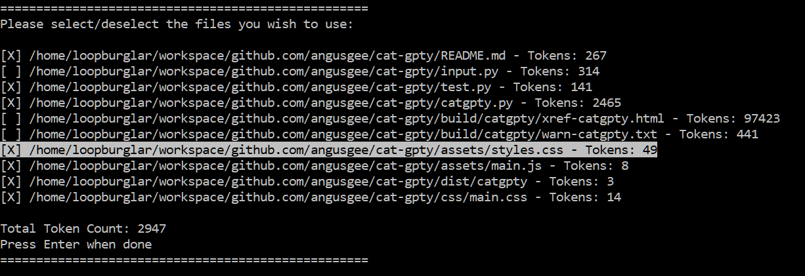
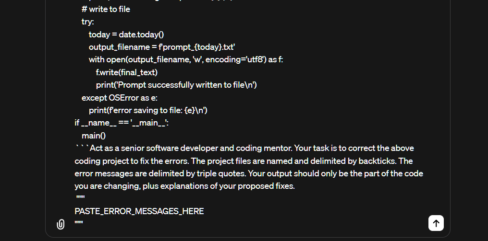

# Cat Gippity

Cat Gippity is a Linux utility for improved prompting.

For optimum results from AI, it's best to give the model the entire context of your project, and use delimiters to help it parse the content. You also want to use very clear proompts to explicitly instruct the model to do your bidding.

However, copying all your project files' contents, delimiting manually, and pasting into ChatGPT or a similar API is time consuming. Also, you won't know you're going to exceed the token limit until you do.

## Solution

⚡ Cat Gippity solves these issues for you ⚡

Run the script from your project folder and choose to add on a pre-proompt:

Select the files you want to include:

The contents of your project files are individually, delimited and concatenated together, then copied to your clipboard.

You get the optimum context from your project with only a couple of key presses. 🚀🚀

Remember to paste in your requirements or error messages if you chose 5. or 6.

💡 Pro tip: iterate! Checking again only takes a few more seconds and helps prevent innacurate results. Why not have it review your code for bugs, then check it again for vulnerabilities?

## Getting started

tbc
