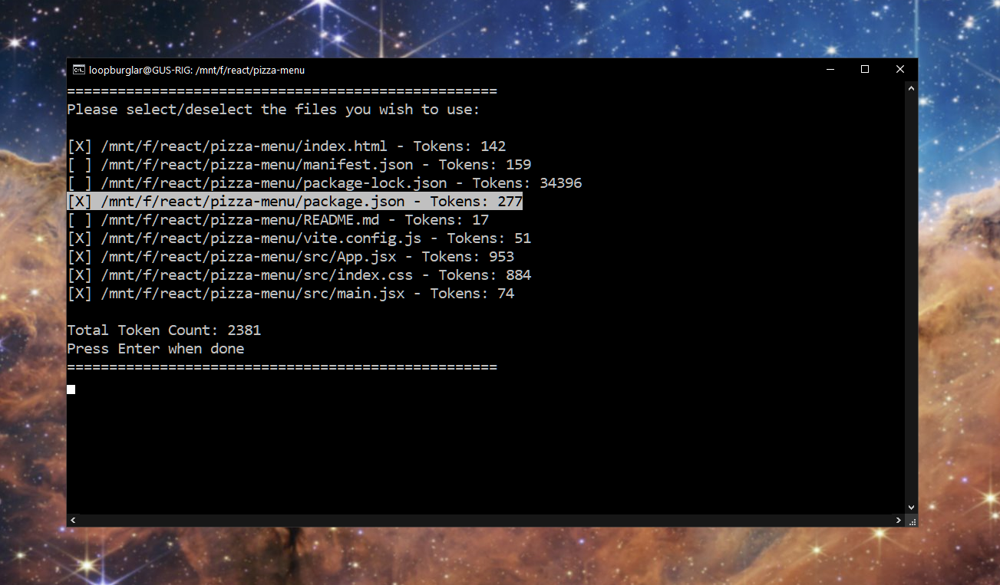
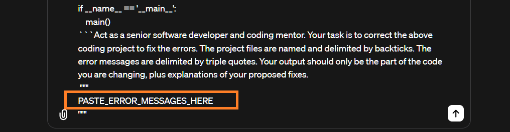
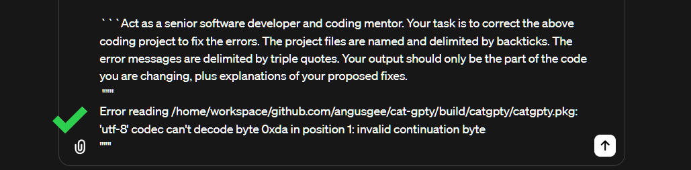

# Cat Gippity

Turbocharge your software development workflows by leveraging the power of AI.

For optimum results from AI models like ChatGPT, you want to:

1. Give the model as much _relevant_ context as possible.
2. Use delimiters to help it understand the content.
3. Explicitly instruct the model to do your bidding with clear and unambiguous prompts.

However, copying your project files, naming them, and delimiting them manually, is time consuming.

Also, you won't know you're going to exceed the token limit until you do:

<p align="center">
  
</p>

## ⚡ The Solution ⚡

Cat Gippity solves these issues for you! 💪🏽

Run the script from your project folder and choose to add on a pre-proompt:

<p align="center">
  
</p>

Select the files you want to include. The token count is dynamically updated:

<p align="center">
  
</p>

The contents of your project files are individually named, delimited, and concatenated together, then copied to your clipboard.

You get the optimum context from your project with only a couple of key presses. 🚀🚀

Remember to paste in your requirements or error messages if you chose 5. or 6:

<p align="center">

</p>

<p align="center">
  
</p>

💡 Pro tip: iterate! Checking again only takes a few more seconds. Why not have the AI review your code for bugs, then check it again for vulnerabilities?

## Getting started

NOTE: this is an early release and has only been tested on Ubuntu.

1. Start by running this command to install the script using curl.

```bash
curl -L "https://github.com/angusgee/cat-gpty/releases/tag/v0.1.0-alpha/catgpty" -o /tmp/catgpty
```

2. Next, move the program into your /usr/local/bin directory - or anywhere else you please:

```bash
sudo mv /tmp/catgpty /usr/local/bin/catgpty
```

3. Finally, give the script executable permissions:

```bash
sudo chmod +x /usr/local/bin/catgpty
```

Now you can run Chat Gippity from any folder:

```bash
catgpty
```
